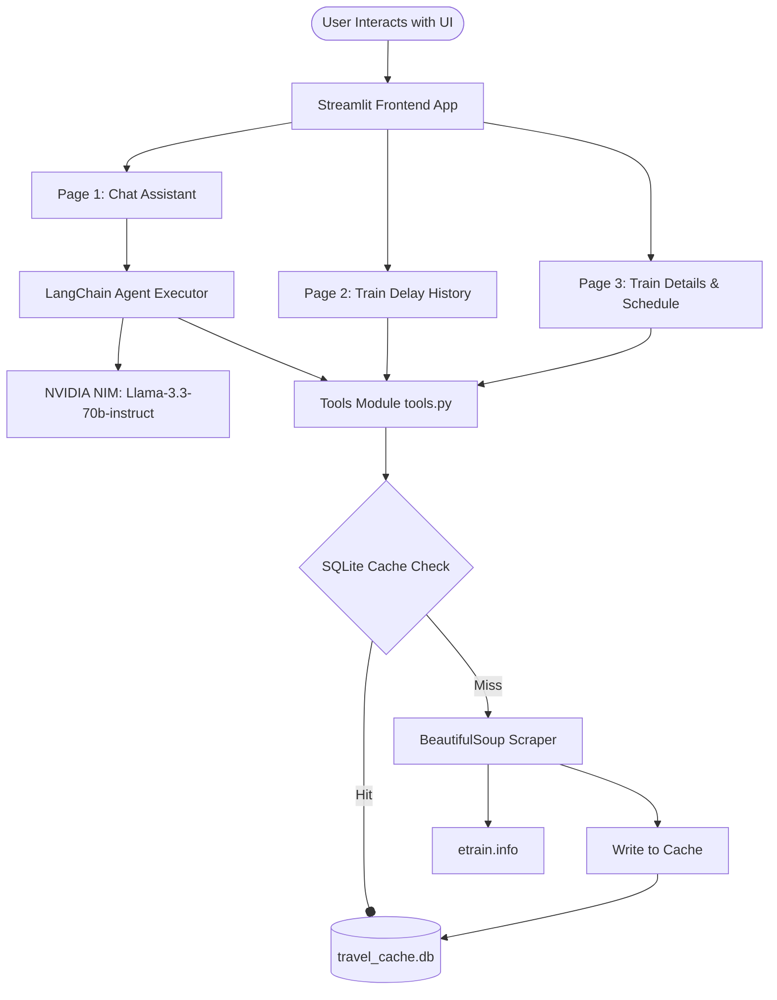

# AI Travel Concierge

An advanced agentic AI travel assistant designed to simplify train route planning, punctuality check, schedule lookups, and fare calculation. Powered by **NVIDIA's Llama 3.3 70B Instruct** model via LangChain and built as a multi-page **Streamlit** dashboard, this application utilizes real-time and historical web scraping to deliver precise travel information.

Developed for the **Agentic AI Saksham Internship (Track A)**, the project has evolved from a basic RAG chatbot to a fully functional Agentic Concierge.

---

## Key Features

The application is structured into three dedicated modules, each designed with a clean, premium, and distraction-free user interface:

### 1. Travel Assistant (AI Agent)
- **Conversational Planning**: Chat with a context-aware AI Concierge to plan journeys.
- **Autonomous Tool-Calling**: The agent automatically determines when to fetch routes, delay histories, or train schedules based on conversation context.
- **True Travel Time Calculation**: Dynamically computes `True Travel Time = Scheduled Duration + Average Delay at Destination` to provide realistic schedules.
- **Smart Recommendations**: Presents structured choices: **Fastest Option**, **Most Reliable Option**, and **Balanced Alternative**.

### 2. Train Delay History
- **Historical Analysis**: Enter a train number and select a timeline (`1 week`, `1 month`, `3 months`, `6 months`, `1 year`).
- **Station-by-Station Breakdown**: Displays a timeline breakdown showing average delays at every scheduled stop.
- **Visual Alert System**: Delay thresholds are color-coded for quick readability:
  - <span style="color:#2ecc71">■</span> **Right Time** (0-15 mins delay) - Green
  - <span style="color:#f1c40f">■</span> **Slight Delay** (15-60 mins delay) - Yellow
  - <span style="color:#e74c3c">■</span> **Significant Delay** (>1 hour delay) - Red
  - <span style="color:#95a5a6">■</span> **Cancelled/Unknown** - Grey

### 3. Train Details & Schedule
- **Train Overview**: Quick metadata header containing train name, type, zones, and running days.
- **Coach Layout**: Visual representation of the rake composition (e.g. SL, 3A, 2A, 1A).
- **Timetable Schedule**: Complete list of stops with arrival, departure, halt times, distances, and day numbers.
- **Interactive Fare Calculator**: A slide-out panel that dynamically calculates ticket fares based on source station, destination, travel quota, and coach class.

---

## System Architecture



---

## Technical Performance Optimizations

1. **SQLite Caching Layer**: All route suggestions, train schedules, and historical delays are cached locally in `travel_cache.db` with customizable expirations. This reduces external HTTP traffic and ensures sub-second responses on repeat queries.
2. **Redirect-Less Scraper**: When scraping train schedules, the tool extracts canonical train slugs directly from schedule links (`/train/{slug}/schedule`), eliminating the need for HTTP redirect checks and reducing sequential network calls by **~45%**.
3. **Smart Station Resolution**: A fuzzy-matching algorithm maps colloquial station names (e.g., "tirupathi" or "duvvada") to their official IRCTC codes (`TPTY`, `DVD`) using a comprehensive local dataset of over 8,000 Indian railway stations.

---

## Database Schema

The SQLite database (`travel_cache.db`) manages three lookup tables:

### 1. `route_cache`
Stores available train options between two stations.
- `src_dst` (TEXT, Primary Key): Combined key of source and destination station codes.
- `data` (TEXT): JSON string containing array of train options.
- `timestamp` (DATETIME): Time of cache entry.

### 2. `delay_cache`
Stores station-by-station delay summaries.
- `train_no_duration` (TEXT, Primary Key): Key combining train number and time window.
- `delay_data` (TEXT): JSON containing delay statuses for stops.
- `timestamp` (DATETIME): Time of cache entry.

### 3. `schedule_cache`
Stores train schedules and rake compositions.
- `train_no` (TEXT, Primary Key): Official train number.
- `schedule_data` (TEXT): JSON containing rake, info card, and timetable schedule.
- `timestamp` (DATETIME): Time of cache entry.

---

## Tech Stack

- **Frontend**: Streamlit
- **Agent Orchestration**: LangChain Core & Community (Tool-Calling Agent)
- **Language Model**: NVIDIA NIM (`meta/llama-3.3-70b-instruct`)
- **Web Scraping**: BeautifulSoup4, Requests, LXML
- **Database**: SQLite3
- **Data Wrangling**: Pandas
- **Configurations**: Python-Dotenv

---

## Local Setup Instructions

### 1. Prerequisites
Ensure you have **Python 3.9+** and **Git** installed on your system.

### 2. Clone the Repository
```bash
git clone https://github.com/Karthik-chukkala/AI_Travel_Concierge.git
cd AI_Travel_Concierge
```

### 3. Set Up a Virtual Environment
```bash
# Windows
python -m venv venv
venv\Scripts\activate

# macOS/Linux
python3 -m venv venv
source venv/bin/activate
```

### 4. Install Dependencies
```bash
pip install -r requirements.txt
```

### 5. Configure Environment Variables
Create a `.env` file inside the `ai-travel-concierge` directory and add your NVIDIA API Key:
```env
NVIDIA_API_KEY=your_nvidia_api_key_here
```

### 6. Run the Application
```bash
streamlit run ai-travel-concierge/app.py
```

---

## Live Demo & Preview

Experience the AI Travel Concierge in action:

* **Live App:** Explore the live deployment on Streamlit Community Cloud here: [AI Travel Concierge Live Demo](https://aitravelconcierge-kae9cvblg6iya8hw2nbei7.streamlit.app/)
* **Video Walkthrough:** Watch a quick demonstration of the app's features: [[Placeholder for Link]]
